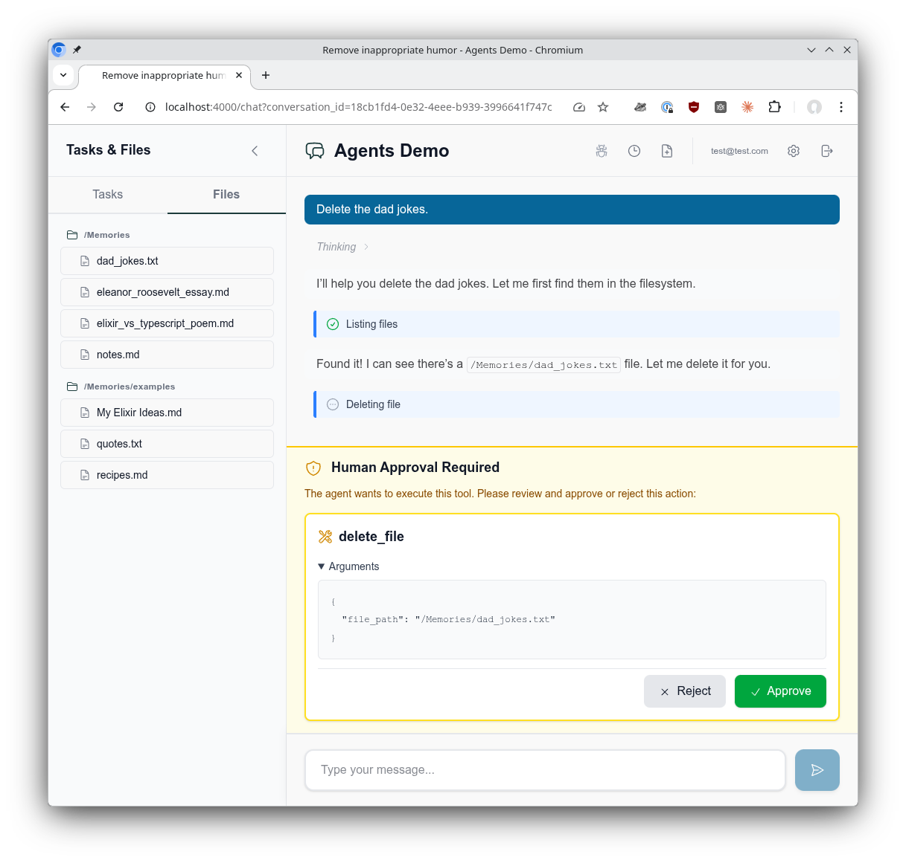

# AgentsDemo

A demonstration Phoenix LiveView application showcasing the Sagents's multi-conversation agent architecture. This project illustrates how to build a chat interface where each conversation has its own isolated AI agent with persistent state, rich middleware capabilities, and real-time updates.

## Features

- **Multi-Conversation Support**: Each conversation gets its own dedicated agent process with isolated state
- **Rich Middleware Stack**: TodoList, FileSystem, SubAgent, ConversationTitle, WebSearch, and Human-in-the-Loop approval
- **Human-in-the-Loop**: The demo is configured to require user confirmation before deleting files, showcasing the approval workflow
- **State Persistence**: Conversations and agent states are saved to PostgreSQL and restored on demand
- **Real-Time Updates**: Phoenix PubSub broadcasts agent events to all connected LiveView clients
- **On-Demand Agent Lifecycle**: Agents start when conversations are accessed and timeout after 1 hour of inactivity

## Demo Application Screenshots


*The chat interface showing the virtual filesystem. Create, read, and manage files through conversation. File deletions require Human-in-the-Loop confirmation.*


*The agent-managed TODO list displayed in the sidebar, tracking tasks across the conversation.*



*Human-in-the-Loop confirmation. The agent pauses and asks for approval before performing sensitive operations like file deletion.*

## Quick Start

To start your Phoenix server:

* Run `mix setup` to install and setup dependencies
* Start Phoenix endpoint with `mix phx.server` or inside IEx with `iex -S mix phx.server`

Now you can visit [`localhost:4000`](http://localhost:4000) from your browser.

**Note**: The core integration files (`lib/agents_demo/agents/coordinator.ex`, `lib/agents_demo/agents/factory.ex`, and `lib/agents_demo_web/live/agent_live_helpers.ex`) are generated by the `mix sagents.setup` task. This task creates the boilerplate needed to integrate the Sagents framework into your Phoenix application.

Ready to run in production? Please [check our deployment guides](https://hexdocs.pm/phoenix/deployment.html).

## Architecture Overview

This application demonstrates the **conversation-centric agent pattern** where each conversation has its own isolated agent process. This architecture provides:

- **Conversation Isolation**: Each conversation's todos, files, and agent state are completely separate
- **Concurrent Conversations**: Multiple conversations can run simultaneously without interference
- **Scalable Resource Management**: Agents automatically start/stop based on usage
- **Multi-Tab Support**: Multiple browser tabs can share the same conversation via PubSub

### Key Components

#### 1. Coordinator (`lib/agents_demo/agents/coordinator.ex`)

**Generated by `mix sagents.setup`** - The Coordinator manages the agent lifecycle for conversations:

```elixir
# Start an agent for a conversation (idempotent - always returns {:ok, session})
{:ok, session} = Coordinator.start_conversation_session(conversation_id)
# => %{agent_id: "conversation-123", pid: #PID<...>, conversation_id: 123}

# Subscribe to agent events
AgentServer.subscribe(session.agent_id)

# Send messages
AgentServer.add_message(session.agent_id, message)
```

**Responsibilities:**
- Maps `conversation_id` to `agent_id` using `"conversation-#{id}"` format
- Starts agents on-demand using the Factory
- Loads saved state from the Conversations context
- Configures 1-hour inactivity timeout
- Handles race conditions (multiple tabs opening same conversation)

#### 2. Factory (`lib/agents_demo/agents/factory.ex`)

**Generated by `mix sagents.setup`** - The Factory defines the agent configuration that applies to ALL conversations:

```elixir
def create_demo_agent(opts) do
  Agent.new!(%{
    agent_id: agent_id,
    model: ChatAnthropic.new!(model: "claude-sonnet-4-5-20250929"),
    middleware: [
      TodoList,              # Task management per conversation
      FileSystem,            # Virtual filesystem per conversation
      SubAgent,              # Spawn sub-agents for parallel work
      Summarization,         # Automatic summarization
      PatchToolCalls,        # Fix malformed tool calls
      HumanInTheLoop,        # Approval workflow for write/delete
      WebTool,               # Web search capability
      ConversationTitle      # Auto-generate conversation titles
    ]
  })
end
```

**Why a Factory?**
- Agent capabilities come from **code**, not database
- All conversations use the same middleware configuration
- Easy to add new features by updating one place
- Middleware state (todos, files) is scoped by `agent_id`

#### 3. Conversations Context (`lib/agents_demo/conversations.ex`)

Database layer for conversation persistence:

```elixir
# CRUD operations
create_conversation(scope, attrs)
get_conversation!(scope, id)
list_conversations(scope, opts)
delete_conversation(scope, id)

# Agent state persistence
save_agent_state(conversation_id, state_data)
load_agent_state(conversation_id)

# Display messages (for UI)
append_text_message(conversation_id, role, text)
append_tool_calls_batch(conversation_id, tool_calls)
load_display_messages(conversation_id)
```

**Data Separation:**
- `conversations` table: Metadata (title, timestamps, user scope)
- `agent_states` table: Serialized agent state (messages, middleware state)
- `display_messages` table: UI-friendly message representations

#### 4. ChatLive (`lib/agents_demo_web/live/chat_live.ex`)

Phoenix LiveView integrating Coordinator with the UI:

```elixir
def handle_params(%{"conversation_id" => id}, _uri, socket) do
  # Start agent session via Coordinator
  {:ok, session} = Coordinator.start_conversation_session(id)

  # Subscribe to agent events
  AgentServer.subscribe(session.agent_id)

  {:noreply, assign(socket, agent_id: session.agent_id)}
end

def handle_event("send_message", %{"message" => text}, socket) do
  # Send to the conversation's specific agent
  AgentServer.add_message(socket.assigns.agent_id, Message.new_user!(text))
  {:noreply, socket}
end

def handle_info({:llm_message, message}, socket) do
  # Receive agent responses via PubSub
  # Persist to database and update UI
  {:noreply, update_ui(socket, message)}
end
```

#### 5. AgentLiveHelpers (`lib/agents_demo_web/live/agent_live_helpers.ex`)

**Generated by `mix sagents.setup`** - Provides streamlined LiveView state management for agent applications:

**Responsibilities:**
- Simplifies boilerplate for common agent-LiveView integration patterns
- Manages agent session lifecycle (start, subscribe, cleanup)
- Handles standard agent event broadcasts (status changes, todos, interrupts)
- Provides convenience functions for message persistence and UI updates
- Reduces code duplication across multiple LiveView modules

**Usage Pattern:**
```elixir
defmodule MyAppWeb.ChatLive do
  use MyAppWeb, :live_view
  import AgentLiveHelpers

  def mount(_params, _session, socket) do
    {:ok, socket}
  end

  def handle_params(%{"conversation_id" => id}, _uri, socket) do
    # Helper function manages session start and subscription
    socket = setup_agent_session(socket, id)
    {:noreply, socket}
  end

  # Helper automatically handles common agent events
  def handle_info(agent_event, socket) do
    handle_agent_event(agent_event, socket)
  end
end
```

The helpers module makes it easier to build agent-powered LiveView applications by encapsulating common patterns for agent lifecycle management and event handling.

### Data Flow

#### Creating a New Conversation

1. User types first message in ChatLive
2. ChatLive creates conversation record in database
3. ChatLive calls `Coordinator.start_conversation_session(conv_id)`
4. Coordinator:
   - Maps `conv_id` → `"conversation-#{id}"`
   - Creates agent via Factory (with full middleware)
   - Creates fresh State (no messages yet)
   - Starts AgentSupervisor tree
5. ChatLive subscribes to agent's PubSub topic
6. ChatLive sends user message to agent
7. Agent executes, broadcasts events
8. ChatLive persists messages and state to database

#### Loading an Existing Conversation

1. User navigates to `/chat?conversation_id=123`
2. ChatLive calls `Coordinator.start_conversation_session(123)`
3. Coordinator:
   - Checks if agent already running (idempotent)
   - If not running:
     - Creates agent via Factory (current code)
     - Loads saved state from database
     - Deserializes state (includes messages + middleware state)
     - Starts AgentSupervisor with restored state
4. ChatLive subscribes and displays conversation
5. Agent state includes todos, filesystem, message history

#### Multi-Tab Scenario

1. Tab A opens `conversation-123` → Coordinator starts agent
2. Tab B opens `conversation-123` → Coordinator returns existing agent (idempotent)
3. Both tabs subscribe to same PubSub topic: `"agent_server:conversation-123"`
4. User sends message from Tab A
5. Agent broadcasts events to PubSub
6. Both Tab A and Tab B receive updates in real-time

### Agent Lifecycle

```
[User Opens Conversation]
         ↓
[Coordinator.start_conversation_session]
         ↓
[Check Registry: Agent Running?]
    ↙          ↘
  YES           NO
   ↓             ↓
Return Pid    Create Agent (Factory)
               Load State (Database)
               Start AgentSupervisor
         ↓
[Agent Running: Handles Messages]
         ↓
[No Activity for 1 Hour]
         ↓
[Agent Stops Automatically]
         ↓
[State Saved to Database]
```

### Middleware State Isolation

Each middleware stores state scoped by `agent_id`:

**TodoList Middleware:**
```elixir
# Conversation 1 (agent_id: "conversation-1")
- Todo: "Research pricing models"
- Todo: "Draft proposal"

# Conversation 2 (agent_id: "conversation-2")
- Todo: "Fix login bug"
- Todo: "Update tests"
```

**FileSystem Middleware:**
```elixir
# Conversation 1 files stored at:
priv/static/public/demo_memories/conversation-1/

# Conversation 2 files stored at:
priv/static/public/demo_memories/conversation-2/
```

State is serialized and saved to `agent_states` table, including all middleware state.

## Code Tour

### Essential Files

**Agent Coordination** (Generated by `mix sagents.setup`):
- [`lib/agents_demo/agents/coordinator.ex`](lib/agents_demo/agents/coordinator.ex) - Lifecycle management
- [`lib/agents_demo/agents/factory.ex`](lib/agents_demo/agents/factory.ex) - Agent configuration

**Database Layer:**
- [`lib/agents_demo/conversations.ex`](lib/agents_demo/conversations.ex) - Conversation context
- [`lib/agents_demo/conversations/conversation.ex`](lib/agents_demo/conversations/conversation.ex) - Schema
- [`lib/agents_demo/conversations/agent_state.ex`](lib/agents_demo/conversations/agent_state.ex) - State schema
- [`lib/agents_demo/conversations/display_message.ex`](lib/agents_demo/conversations/display_message.ex) - Message schema

**Phoenix LiveView:**
- [`lib/agents_demo_web/live/chat_live.ex`](lib/agents_demo_web/live/chat_live.ex) - Main chat interface
- [`lib/agents_demo_web/live/agent_live_helpers.ex`](lib/agents_demo_web/live/agent_live_helpers.ex) - LiveView state management helpers (Generated by `mix sagents.setup`)

**Custom Middleware:**
- [`lib/agents_demo/middleware/web_tool_middleware.ex`](lib/agents_demo/middleware/web_tool_middleware.ex) - Web search integration (example of custom middleware)

### Customization Guide

#### Change Agent Configuration

Edit the generated [`lib/agents_demo/agents/factory.ex`](lib/agents_demo/agents/factory.ex:1) to add/remove middleware or change models:

```elixir
def create_demo_agent(opts) do
  Agent.new!(%{
    model: ChatAnthropic.new!(model: "claude-3-5-haiku-latest"), # ← Change model
    middleware: [
      TodoList,
      # FileSystem,  # ← Comment out to disable
      MyCustomMiddleware,  # ← Add new middleware
      # ...
    ]
  })
end
```

#### Change Agent Mapping Strategy

Edit the generated [`lib/agents_demo/agents/coordinator.ex`](lib/agents_demo/agents/coordinator.ex:1):

```elixir
# User-centric: One agent per user (shared across conversations)
def conversation_agent_id(conversation_id) do
  user_id = Conversations.get_user_id(conversation_id)
  "user-#{user_id}"
end

# Team-centric: One agent per team
def conversation_agent_id(conversation_id) do
  team_id = Conversations.get_team_id(conversation_id)
  "team-#{team_id}"
end
```

#### Add Custom Display Message Types

1. Add new content_type to [`display_messages`](lib/agents_demo/conversations/display_message.ex:1) schema
2. Add handler in [`Conversations`](lib/agents_demo/conversations.ex:1) context:
   ```elixir
   def append_custom_message(conversation_id, data) do
     # Create DisplayMessage with content_type: "custom"
   end
   ```
3. Update [`ChatLive`](lib/agents_demo_web/live/chat_live.ex:1) to handle new type
4. Add UI component in chat_components

#### Adjust Inactivity Timeout

Edit the generated [`lib/agents_demo/agents/coordinator.ex`](lib/agents_demo/agents/coordinator.ex:1):

```elixir
supervisor_opts = [
  inactivity_timeout: :timer.hours(2)  # ← Change from 1 hour to 2 hours
  # OR: :infinity to never timeout
]
```

## Web Search Tool - Custom Middleware Example

The web search tool serves as a **practical example of creating custom middleware** for the Sagents framework. The implementation in [`lib/agents_demo/middleware/web_tool_middleware.ex`](lib/agents_demo/middleware/web_tool_middleware.ex) demonstrates:

- How to implement the `Middleware` behavior
- Providing custom tools to the agent
- Integrating external services (DuckDuckGo search)
- Spawning sub-agents for parallel work (page analysis)
- Performing web searches using your own hardware instead of a service

**Technical Stack:**

Uses DuckDuckGo with personal-use-only flags to clean up results:
- https://duckduckgo.com/duckduckgo-help-pages/settings/params

Uses Chris McCord's "web" project for page scraping:
- https://github.com/chrismccord/web
- Embeds a local Firefox browser for JavaScript-enabled page rendering

Step 0:
- Download the appropriate binary for your platform from [web project page](https://github.com/chrismccord/web).
  - web-darwin-amd64
  - web-darwin-arm64
  - web-linux-amd64
- Rename the downloaded binary to `web`
- Place the binary in `priv/`

Step 1:
- Data extraction of the top results from a search. Returns JSON information.

Step 2:
- Main agent uses links to spawn separate task to fetch the provided link
- Sub-Agent fetches the page and performs document analysis for how the web-page answers the original question
- Sub-Agents return the names of the created analysis documents

```
./web "https://duckduckgo.com?kl=en-us&kp=-1&kz=-1&kc=-1&ko=-1&k1=-1" --form "searchbox_homepage" --input "q" --value "What is the tallest building in the world?"
```

Reading a page:
```
./web "https://www.wionews.com/photos/10-tallest-buildings-in-the-world-9016954"
```
